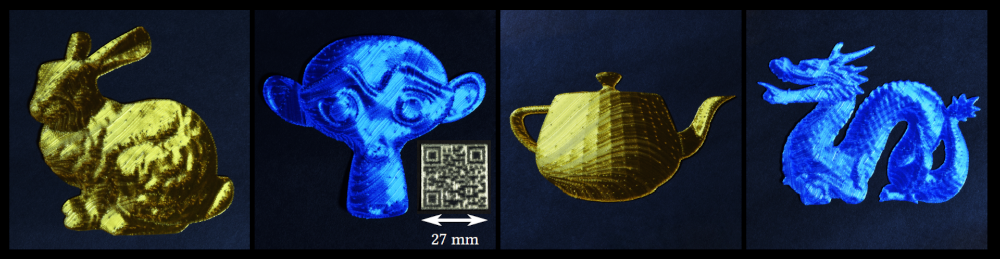
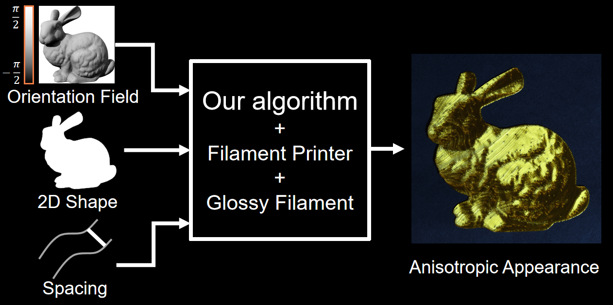
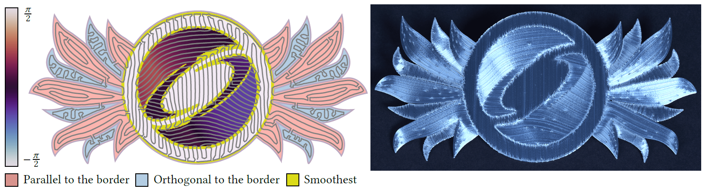

# Orientable Dense Cyclic Infill for Anisotropic Appearance Fabrication - Code



This repository contains the source code associated with the paper:

**[Orientable Dense Cyclic Infill for Anisotropic Appearance Fabrication](https://xavierchermain.github.io/fdm_aa/)**

*[Xavier Chermain](https://xavierchermain.github.io), [Cédric Zanni](https://members.loria.fr/CZanni/), [Jonàs Martínez](https://sites.google.com/site/jonasmartinezbayona/), [Pierre-Alexandre Hugron](https://twitter.com/HugronPa), and [Sylvain Lefebvre](https://www.antexel.com/sylefeb/research)*

[Université de Lorraine](https://www.univ-lorraine.fr/en/univ-lorraine/), [CNRS](https://www.cnrs.fr/en), [Inria](https://www.inria.fr/en), [Loria](https://www.loria.fr/en/)

[SIGGRAPH 2023](https://s2023.siggraph.org/), DOI: [10.1145/3592412](https://doi.org/10.1145/3592412)

- [Project page](https://xavierchermain.github.io/fdm_aa/)
- [Article](https://xavierchermain.github.io/data/pdf/Chermain2023Orientable.pdf)
- [Supplemental Video](https://youtu.be/aUDzZrlRnNU)

# Fill Space With Orientable Cycle - Our Algorithm



Our code allows you to reproduce the results of our [paper](https://xavierchermain.github.io/fdm_aa/), whose objective is to fabricate anisotropic appearances with a filament printer and a glossy filament.

Our algorithm generates a continuous trajectory from an orientation field, a 2D shape, and spacing from adjacent paths. In other words, our algorithm fills a closed 2D space with an orientable cycle. The code is in the [`tools/fill_2d_shape.py`](tools/fill_2d_shape.py) file, and a usage example is in the [`tools/README.md`](tools/README.md#fill_2d_shapepy).

The generated continuous trajectory is then given to a filament printer, which fabricates a 2D plate with oriented extruded filaments. The 2D object has an anisotropic appearance if a glossy filament is used.

# Outline

- [Installation](#installation)
- [Results Reproduction](#results-reproduction)
- [Folder Organization](#folder-organization)
- [Anisotropic Appearance Representation](#anisotropic-appearance-representation)
- [2D Shape Representation](#2d-shape-representation)
- [How to Cite](#how-to-cite)
- [License](#license)

# Installation

## Clone the Repository

To clone the code together with the [`iceslprinters`](https://github.com/shapeforge/icesl-printers) dependency, be sure to use the `--recursive` flag when cloning the repository, i.e.
```
git clone --recursive https://github.com/mfx-inria/anisotropic_appearance_fabrication.git
```
If you accidentally already cloned the code without this argument, run the following command to fetch the dependency:
```
git submodule update --init --recursive
```

## Install Python Module Dependencies

The code is written in Python 3.10, and it depends on
- [JAX](https://github.com/google/jax) 0.3.17,
- [svgpathtools](https://github.com/mathandy/svgpathtools) 1.6,
- [pyvista](https://github.com/pyvista/pyvista) 0.39,
- [Pillow](https://github.com/python-pillow/Pillow) 9.5, and
- the local library [`src/cglib`](src/cglib).

The versions specified before were used for producing the paper's results but are not strictly needed.

You can use `pip` to install the dependencies:
```
pip install --user --upgrade pip
pip install --user --upgrade "jax[cpu]"
pip install --user svgpathtools pyvista Pillow
pip install --user -e .
```

The most challenging dependency to install is [JAX](https://github.com/google/jax) *if you want GPU support*. Please read its [installation section](https://github.com/google/jax#installation) for more information. The code was developed on Windows 10, with GPU support (see [`INSTALL_WIN10_GPU.txt`](INSTALL_WIN10_GPU.txt) for installation details).

### Conda

For Conda users, you can try
```
conda env create -f environment.yml
conda activate fdm_aa
pip install --user -e .
```
to install the Python environment. On Windows, it did not work on our machine, but it works on Mac.

# Results Reproduction

You can reproduce either the figure 1 or all the results of the [paper](https://xavierchermain.github.io/data/pdf/Chermain2023Orientable.pdf) on Windows by running either the script `generate_results_figure_1.ps1` or the script `generate_all_results.ps1`, *resp*. For Linux users, use `generate_results_figure_1.sh` or `generate_all_results.sh`, *resp*.

The scripts generate the oriented cycles as SVG files in [`data/svg/cycle`](data/svg/cycle) and as G-code files in [`data/gcode`](data/gcode). You can visualize and check the paths in the generated G-code using [Craftware](https://craftbot.com/craftware/legacy) or the online visualizer of [IceSl](https://icesl.loria.fr/webprinter/). The G-codes are generated for a modified Creality3D CR-10S Pro with a BLTouch and direct drive extruder. The firmware used to print the results is [Klipper](https://www.klipper3d.org/). We recommend using an extrusion factor of 0.9 % and a filament printer with a [direct drive extruder](https://en.wikipedia.org/wiki/3D_printer_extruder), as the trajectory has a varying length.

Note that the generated results are similar to the [paper](https://xavierchermain.github.io/data/pdf/Chermain2023Orientable.pdf)'s but not identical. We refactored the code since we submitted the final version of the [paper](https://xavierchermain.github.io/data/pdf/Chermain2023Orientable.pdf) and we changed the random number generator.

## OS and Backend

Our code was tested on
- Windows 10 with GPU backend,
- Ubuntu LTS 22.04 with CPU backend, and
- MacOS, on a MacBook Pro M1 Max with Monterrey OS, with CPU backend.

Our code is written with JAX, which is designed for high-performance numerical computing. We chose it because it provides a familiar NumPy-style API and the same code can be executed on CPU and GPU. See the [installation section of JAX](https://github.com/google/jax#installation) to know if your *OS and backend are supported*.

## Long Running Times

The execution time of the scripts can be considered long. For example, on Ubuntu LTS 22.04 with a CPU backend (AMD Ryzen 9 7950X 32 threads), on Windows 10 with a GPU backend (NVIDIA RTX 2080 with Intel Core i7-4770K CPU) and on MaxOS with CPU backend, the execution times of the scripts `generate_results_figure_1.sh` and `generate_all_results.sh` are around 250 seconds and 35 minutes, *resp*.

JAX compiles functions to speed the execution, but the compilation time is linear with the data size, as shown by the paper [Dr.Jit: A Just-In-Time Compiler for Differentiable Rendering](https://rgl.s3.eu-central-1.amazonaws.com/media/papers/Jakob2022DrJit.pdf), Figure 17, top right. In addition, JAX recompiles functions each time the code is launched because the compilation cache is still an experimental feature: [https://github.com/google/jax/discussions/13736](https://github.com/google/jax/discussions/13736). See the logs in [`data/log`](data/log) to know the execution and compilation times.

## Warnings and Errors

[XLA](https://www.tensorflow.org/xla), used by JAX, can print a too long compilation time warning, i.e., `Constant folding an instruction is taking > 1s`.

When using the GPU, the following error can appear:
```
LLVM ERROR: IMAGE_REL_AMD64_ADDR32NB relocation requires an ordered section layout
```
Quick "fix": rerun.

See [https://github.com/tensorflow/tensorflow/issues/56207](https://github.com/tensorflow/tensorflow/issues/56207).

## G-codes of the Paper's Results

We can download the G-codes of the paper's results with this link: [https://drive.google.com/file/d/18oH3z5xaFOeRKn6aXpxDUmBwcsN7m1Eb/view?usp=sharing](https://drive.google.com/file/d/18oH3z5xaFOeRKn6aXpxDUmBwcsN7m1Eb/view?usp=sharing). The G-codes were generated for a modified Creality3D CR-10S Pro with a BLTouch and direct drive extruder. The firmware used to print the results is [Klipper](https://www.klipper3d.org/). The extrusion factor was 0.9.

## Filaments and Nozzle

We test our method with the following filaments:
- [Arianeplast](https://www.arianeplast.com/)
  - [Clear PETG, FPETGTR1175](https://www.arianeplast.com/3d-filament-petg/344-petg-translucide-3d-filament-arianeplast-fabrique-en-france.html) (used for roughness measurements, Sec. 3)
  - [PLA+ Bleu/Gris. FPLABLGR2175](https://www.arianeplast.com/pla-format-23kg/511-pla-bleugris-4043d-3d-filament-arianeplast-23kg-fabrique-en-france-.html) (used for roughness measurements, Sec. 3)
- [Form Futura](https://formfutura.com)
  - [High Gloss PLA](https://formfutura.com/product/high-gloss-pla/)
    - Gold (Fig. 4, 12 middle, 15 bunny and teapot)
    - Silver (Fig. 1, 2, 12 right, 13, 15 QR code)
  - Silk Gloss PLA Brillant Blue (used for roughness measurements, Sec. 3, Fig. 5)
  - [HDglass PETG. See Through Red](https://formfutura.com/product/hdglass/) (used for roughness measurements, Sec. 3)
- [Polymaker](https://us.polymaker.com/). [PolyLite PLA. Silk Blue](https://us.polymaker.com/products/polylite-silk-pla?_pos=1&_sid=f7c00b1e0&_ss=r&variant=40302810529849) (Fig. 11, 12 left, 15 monkey and dragon)


We used filaments with 1.75 mm diameter.

The references of the 0.4 and 0.8 nozzles are: [Bondtech CHT MOS Coated Brass Nozzle](https://www.bondtech.se/product/bondtech-cht-coated-brass-nozzle/).

# Folder Organization

- [`tools`](tools/): Contain tools, e.g., `fill_2d_shape.py` which is the algorithm 1 of the [paper](https://xavierchermain.github.io/data/pdf/Chermain2023Orientable.pdf). See the [`tools/README.md`](tools/README.md) to know the tools list.
- [`src`](src/): Contain the source code of the local `cglib` library, which contains core functionalities. You can also find `tools/togcode.py`'s theoretically supported printers at [`src/ext/iceslprinters/fff`](src/ext/iceslprinters/fff).
- [`data`](data/): Contain the data needed by the repository. See [`data/README.md`](data/README.md) for more informations. There is no data restriction usage.
- [`examples`](examples/): Contain a few examples of `src/cglib` function usage.
- [`tests`](tests/): Contain the tests of the local `cglib` library. Can be used as example usages of `cglib`'s functions.

# Anisotropic Appearance Representation

The anisotropic appearance is represented with an *orientation field*, defining the orientation of anisotropy for each point of a 2D shape. The most common material exhibiting an anisotropic appearance is brushed metal. The orientation of anisotropy can be seen as the brushing orientation of the metal. This input is represented as a PNG grayscale image (8 bits per pixel), whose pixel value is mapped to an orientation angle in $[-\pi / 2, \pi / 2)$. Examples of orientation/line fields are located in [data/png](data/png), and a detailed description of this input can be found in the [parameter description](data/README.md#input-description) (see `line_field_path` parameter).

## Direction Mode Maps



Four types of orientation can be prescribed with a direction mode map:
- **Parallel to the border** (red areas in the previous figure),
- **orthogonal to the border** (blue areas in the previous figure),
- **smoothest** (yellow areas in the previous figure), or
- **constrained** (color gradient areas in the previous figure). 

These four modes are represented with a PNG grayscale image (8 bits per pixel), whose pixel value is mapped to one of the four modes. Examples of direction mode maps are located in [data/png](data/png), and a detailed description of this input can be found in the [parameter description](data/README.md#input-description) (see `line_mode_field_path` parameter).

# 2D Shape Representation

The 2D shape is represented as a polygonal chain, encoded as a SVG file. Examples of 2D shapes are located in [data/svg](data/svg), and a description of this input can be found in the [data/svg/README.md](data/svg/README.md#input-2d-shapes).

# How to Cite

If you use our algorithm, please cite it using the following BibTeX entry:

```
@article{Chermain2023Orientable,
author = {Chermain, Xavier and Zanni, C{\'e}dric and Mart{\'i}nez, Jon{\`a}s and Hugron, Pierre-Alexandre and Lefebvre, Sylvain},
title = {Orientable Dense Cyclic Infill for Anisotropic Appearance Fabrication},
year = {2023},
volume = {42},
number = {4},
doi = {10.1145/3592412},
articleno = {68},
journal = {ACM Trans. Graph. (Proc. SIGGRAPH)},
numpages = {13}
}
```

# License

The source code is under the BSD 3-Clause "New" or "Rivised" license. See
[LICENSE](LICENSE) for more details.
