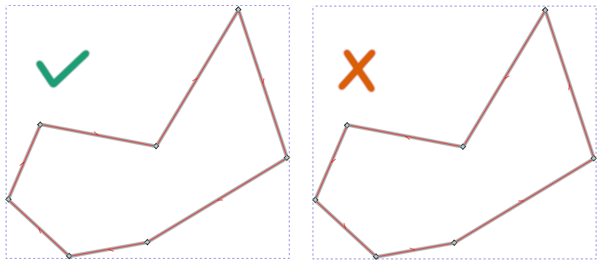
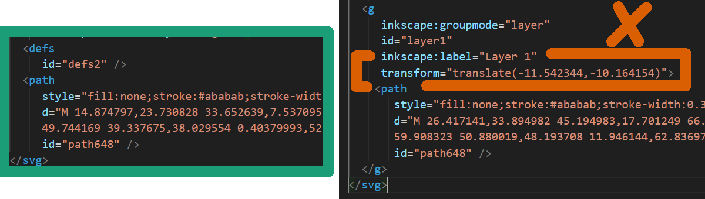
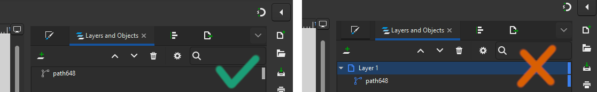
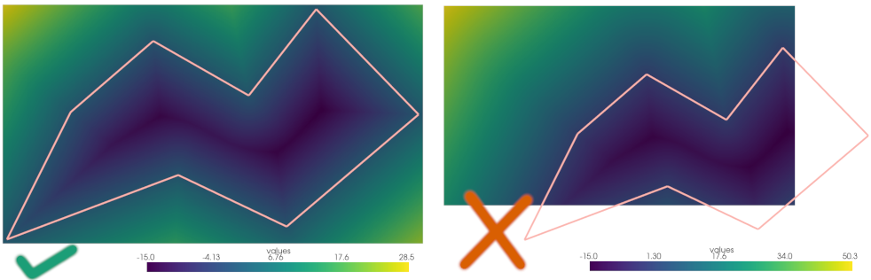

# Description

This folder contains
- 2D shapes that can be filled with an orientable cycle with the script
  `tools/fill_2d_shape.py`,
- The scripts using the tool `tool/tosvg.py` generate SVG files in the folder
  `cycle`.

# Input 2D Shapes

The 2D shapes are represented with files in SVG format. Only SVG objects **path** can be imported.

We use Inkscape 1.3.2 to edit them. Be sure that the contour is a clockwise-oriented closed polyline. Holes in the shape are represented with counter-clockwise oriented closed polylines. To see the orientation of a path:
1. Check the option Edit:Preferences:Tools:Node Tool:Show path direction on outlines.
2. Select your path and click on Node tool.

If the orientation is incorrect, you can reverse it with Path:Reverse.

A correct and incorrect orientation is shown in the following figure.

The `svg` width and height attributes determine the shape domain size. To resize the page to your shape, select it, then Edit:Resize Page To Selection (`Ctrl+Shift+R`).

Transformations inside the SVG are ignored, so only SVG files without transformations are valid, like in the following figure on the left.

When layers are used, Inkscape hides transformations inside the SVG file. In addition, Inkscape automatically creates one default layer. You have to remove all the layers to remove implicit transformations and have points in world space. To do this, open the Layers and Objects tab (Object:Layers and Objects). Drag and drop your shape at the root, e.g., above `Layer 1`, and delete the layer (select it, then press `Suppr`). Then, resize the page to your shape to remove the implicit transformation (`Ctrl+Shift+R`). You should have a hierarchy like the one in the following figure on the left.

You must force the SDF recomputation if you already computed the signed distance field with the wrong contour, like in the right part of the following figure. To do this, put `force_sdf_computation` to `true` in the `json` file. To see the SDF, use the command `python .\tools\visualize.py .\data\test.json sdf`, where `test.json` is the `json` file containing your parameters.

