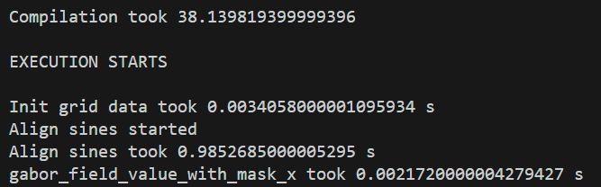

# Tools

The code of the paper is in the tool [`fill_2d_shape.py`](#fill_2d_shapepy).

The other tools can be run after `fill_2d_shape.py` was used:
- [`visualize.py`](#visualizepy)
- [`togcode.py`](#togcodepy)
- [`tosvg.py`](#togcodepy)
- `grid_sines_to_txt.py`: Convert the grid of aligned sines generated by `fill_2d_shape.py` to a text file.
- `cycle_to_txt.py`: Convert the cycle with varying radius generated by `fill_2d_shape.py` to a text file.

# fill_2d_shape.py

Fill a 2D shape with an oriented cycle. See Algorithm 1 in Chermain et al.
2023.

## Usage

```
usage: fill_2d_shape.py [-h] [--nodumping] input_filename

Input: A json file containing all the input parameters. Output: A cycle with varying width.

positional arguments:
  input_filename        Use the inputs in the file specified here.

options:
  -h, --help   show this help message and exit
  --nodumping  To not save intermediate data.
```

### Example

From the root of the repository
```
python tools/fill_2d_shape.py data/teaser_coarse.json
```

If the program is stuck at step `gabor_field_value_with_mask_x took`, as in the following figure, you should have non-valid `svg` input. Please follow instructions in the [`data/svg/README.md`](../data/svg/README.md)


## Input

A json file containing all the input parameters. See [`data/README.md`](../data/README.md).

## Ouputs

In the following, all ouputs are described. <input_filename> is the tail of the
input path without the extension.

- **Grid of sines aligned**; `data/np/<input_filename>_grid_sines_aligned.npz`; The grid of sine waves after the alignment process.
- **Scalar field**; `data/np/<input_filename>_scalar_field.npy`; The scalar field resulting from the evaluation of the aligned sine field.
- **Contour graph**; `data/np/<input_filename>_contour_graph.npz`; The contour of the scalar field represented as a graph (vertices/points with adjacency  lists).
- **Cycles**; `data/np/<input_filename>_cycles.npz`; The cycles after the contouring and before the stitching.
- **Cycle**; The cycle after the stitching process. Each point is associated with a trajectory width.
  - **Polyline**; `data/np/<input_filename>_polyline_3d.npz`; The cycle is represented in polyline format. The attribute `point` has shape `(1, N, 2)`, where `N` is the number of cycle points. The attribute `point_data` has shape `(1, N)` and represents the radius of each point. The attribute `data` has shape `(1, 2)`, where `data[:, 0]` and `data[:, 1]` give the number of points and the layer height for each polyline, *resp*.
  - **Text file**; `data/paths/<input_filename>.paths`; The cycle is represented in text file format. Each line of the text file has four floats: `x y z w`.
- **G-code**; `data/gcode/<input_filename>.gcode`; Instructions to provide to the machine controller.
- **VTK 2D shape**; `data/vtk/<input_filename>_boundary.vtk`; The 2D shape boundaries in [VTK](https://vtk.org/)/[pyvista](https://docs.pyvista.org/version/stable/) format. Used by the visualizer.
- **VTK boundary normals**; `data/vtk/<input_filename>_boundary_normal.vtk`; The boundary normals in [VTK](https://vtk.org/)/[pyvista](https://docs.pyvista.org/version/stable/) format.
- **SDF** `data/np/<input_filename>_sdf_<shape_grid_cell_ndcount>_<seed>_<grid_cell_sides_length>.npz`, where `<shape_grid_cell_ndcount>` is the shape grid cell ND count, `<seed>` is the seed used to perturb the points, and `<grid_cell_sides_length>` is the shape grid cell sides length. See `fdm_aa.py:ShapeDomainGridData:save`.

The program does not dump the *grid of sines aligned*, the *scalar field*, the
*contour graph*, and the *cycles before stitching* if the optional argument
`nodumping` is used when launching the program.

## Log

Logs are generated in `data/log/<input_filename>.log`.

# visualize.py

Once you have filled the 2D shape with an orientable cycle, you can see it with this script. The oscillating scalar field or the signed distance field can also be visualized.

## Usage

```
usage: visualize.py [-h] input_filename datatosee

Tool to visualize the cycle with varying radius, or the scalar field generated by fill_2d_shape.py, or the signed distance field.  
Input: The JSON file used by fill_2d_shape.py.

positional arguments:
  input_filename  The JSON file used by fill_2d_shape.py
  datatosee       The data to visualize. Either `tube` to see the cycle, or `scalar` to see the scalar field which is the
                  evaluation of the grid of aligned sines, or `sdf` to see the signed distance field of the 2D shape.

options:
  -h, --help      show this help message and exit
```

### Example

Working directory: the root of the repository.
```
python tools/visualize.py data/teaser_coarse.json sdf
python tools/visualize.py data/teaser_coarse.json scalar
python tools/visualize.py data/teaser_coarse.json tube
```
assuming that
```
python tools/fill_2d_shape.py data/teaser_coarse.json
```
was launched.

# togcode.py

Once you have filled the 2D shape with an orientable cycle, you can transform it to filament printer instructions, i.e., a G-code file, with this script.

**Disclaimer: The generated G-codes are at your own risk. Most filament printers are different, so you must check if the generated G-code does not break your machine. We only test the script for a modified Creality3D CR-10S Pro with a BLTouch and direct drive.**

You can visualize and check the paths in the generated G-code using [Craftware](https://craftbot.com/craftware/legacy) or the online visualizer of [IceSl](https://icesl.loria.fr/webprinter/).

The name of the folders at `src/ext/iceslprinters/fff` are valid inputs of the positional argument `printer_profile`.

## Usage

```
usage: togcode.py [-h] [-nw NOZZLE_WIDTH] [-s SPEED] [-fm FLOW_MULTIPLIER] [-lc LAYER_COUNT]
                  [-bt BED_TEMP] [-et EXTRUDER_TEMP] [-lh LAYER_HEIGHT]
                  [-fd FILAMENT_DIAMETER]
                  input_filename printer_profile

Convert the cycle generated by fill_2d_shape.py to machine instructions. Input: The JSON file   
used by fill_2d_shape.py. Output: The G-code to print the generated cycle.

positional arguments:
  input_filename        The JSON file used by fill_2d_shape.py.
  printer_profile       The printer profile. Only 'CR10S_Pro' was tested. In theory, the name   
                        of the folders at `src/ext/iceslprinters/fff` are valid inputs.

options:
  -h, --help            show this help message and exit
  -nw NOZZLE_WIDTH, --nozzle_width NOZZLE_WIDTH
                        The nozzle diameter in millimeter. Default: the nozzle width in the     
                        input file.
  -s SPEED, --speed SPEED
                        The speed of the moving head, in mm/s. Default: 30.
  -fm FLOW_MULTIPLIER, --flow_multiplier FLOW_MULTIPLIER
                        The flow multiplier. Default: 1
  -lc LAYER_COUNT, --layer_count LAYER_COUNT
                        The number of layers. Default 3.
  -bt BED_TEMP, --bed_temp BED_TEMP
                        The bed temperature in degree Celsius. Default: 55.
  -et EXTRUDER_TEMP, --extruder_temp EXTRUDER_TEMP
                        The extruder temperature in degree Celsius. Default: 215.
  -lh LAYER_HEIGHT, --layer_height LAYER_HEIGHT
                        The layer height. Default: the layer height associated with the
                        polyline.
  -fd FILAMENT_DIAMETER, --filament_diameter FILAMENT_DIAMETER
                        The filament diameter of the filament used by the printer. Default:
                        1.75 mm.
```

### Example

Working directory: the root of the repository.
```
python tools/togcode.py data/teaser_coarse.json CR10S_Pro
```
assuming that
```
python tools/fill_2d_shape.py data/teaser_coarse.json
```
was launched.

# tosvg.py

Once you have filled the 2D shape with an orientable cycle, you can transform it into a SVG file with this script. The cycles before stitching can also be exported to a SVG file.

## Usage

```
usage: tosvg.py [-h] input_filename datatoexport svg_out_filename

Convert the trajectory to SVG. Input: The JSON file used by fill_2d_shape.py to genrate the trajectory and a path for the SVG. Output: The trajectory in SVG format.

positional arguments:
  input_filename    The JSON file used by fill_2d_shape.py to genrate the trajectory.
  datatoexport      The data to export. Either `cycle` (the cycle after stitching) or `cycles` (the cycles before stitching).
  svg_out_filename  The path of the output SVG.

options:
  -h, --help        show this help message and exit
```

### Example

```
python tools/tosvg.py data/teaser_coarse.json cycle data/svg/cycle/teaser_coarse.svg
```
